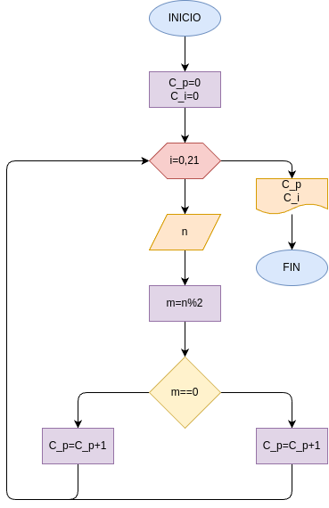

# PUNTO #1
- Hacer el disagrama de flujo y la programcion en python, que lea 20 numeros y que averigue e imprima cuantos son pares y cuantos impares

## DIGRAMA DE FLUJO

# Punto #2
- Hacer el diagrama de flujo y el programa en python, que averigue e imprima cuantos multiplos de 7, y cuantos multiplos de 9 hay en los numeros comprendidos entre 1000 y 5000