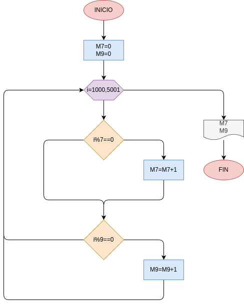

# Punto #2
-Hacer el diagrama de flujo y el programa en python, que averigue e imprima cuantos multiplos de 7, y cuantos multiplos de 9 hay en los numeros comprendidos entre 1000 y 5000
## DIAGRAMA DE FLUJO
